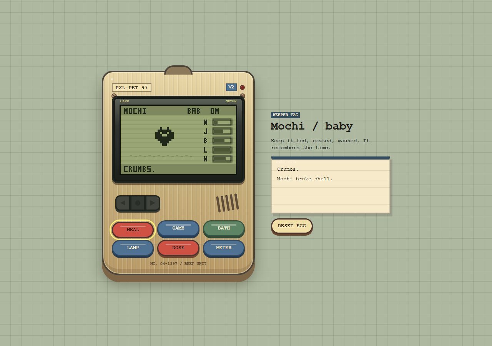

# PXL-PET 97



A tiny retro Tamagotchi-style browser game with persistent pet care, chunky LCD pixel art, and beep-boop Web Audio feedback.

## Play Locally

```bash
npm start
```

Then open [http://localhost:4173](http://localhost:4173).

## Features

- Persistent pet state saved in `localStorage`
- Offline aging, stat decay, evolution, sickness, and death
- Feed, play, clean, lamp/sleep, medicine, and meter controls
- Canvas-rendered pixel sprites with crisp LCD styling
- Retro handheld shell, care tape log, and button feedback
- Web Audio API beeps for actions and events

## Test

```bash
npm test
```

The tests cover core stat decay, care actions, evolution thresholds, sickness, starvation, save/load, corrupt save recovery, and offline progress.
